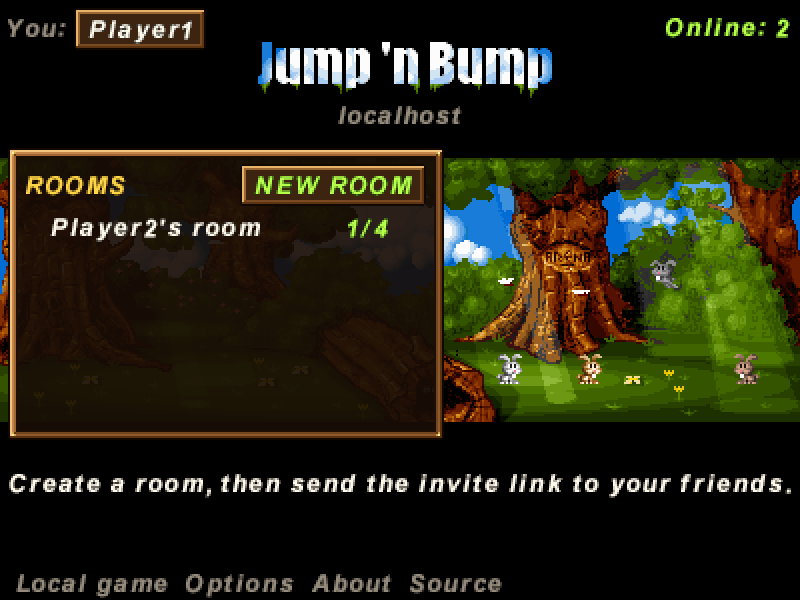
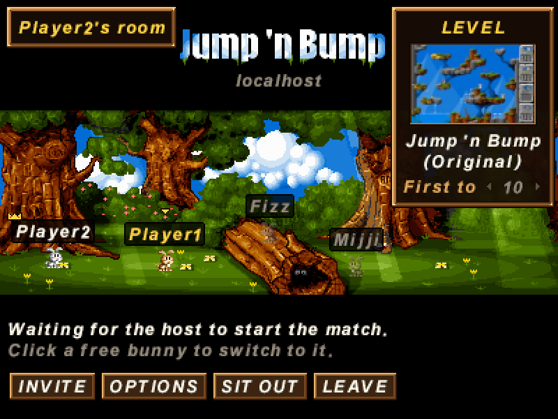
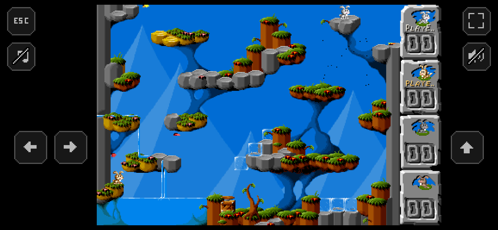
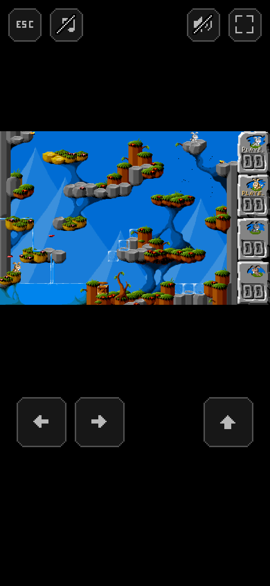

# Jump 'n Bump Online


A self-hostable, browser-based **online multiplayer** version of _Jump 'n Bump_, the 1998 bunny game in which you
score by jumping on the other bunnies' heads. Players only need a browser: create a room, send your friends the
invite link, pick one of 250+ levels and play, each on your own device.

| The lobby                                         | A room                                         |
| ------------------------------------------------- | ---------------------------------------------- |
|  |  |

## The original

- **Jump 'n Bump** was released in 1998 by **Brainchild Design** (Mattias Brynervall, Andreas Brynervall, Martin
  Magnusson, Anders Nilsson) as a DOS game for up to four players sharing one keyboard.
- Its source was released under the GPL. Chuck Mason ported it to Linux with SDL, and later maintainers moved it to
  SDL2 ([LibreGames/jumpnbump](https://gitlab.com/LibreGames/jumpnbump)).
- Jamie Sinclair ported the SDL2 code line by line to TypeScript
  ([jamsinclair/jumpnbump.js](https://github.com/jamsinclair/jumpnbump.js)), playable at
  [jumpnbump.net](https://jumpnbump.net). It adds 250+ fan levels, gamepad support and a web UI.

This repository is a fork of jumpnbump.js. It keeps the original local game and adds an online mode with a lobby
and a server. The game physics are unchanged: the player movement, collision and scoring code is the same code,
moved into a shared module, and a test comparing the old and new code on every level found no difference.

### Contributions from other forks

- The 8 kHz sound effect correction comes from
  [Teqnosys/jumpnbump.js](https://github.com/Teqnosys/jumpnbump.js). The commit was cherry-picked with its original
  author and a reference to the source commit preserved in the git history.
- **Moonlit Canopy**, a moonlit forest arena, and its preview were imported from
  [logsol/jumpnbump.js](https://github.com/logsol/jumpnbump.js).

## What it is good for

- Playing Jump 'n Bump with friends who are not in the same room, over the internet or the local network.
- Hosting it yourself: one container (or one Node.js process) serves the website and runs the game server. There
  are no accounts, no database and no external services.

Features of the online mode:

- A lobby with rooms. Rooms can be protected with a password, and each room has an invite link (`/?room=<id>`).
- Up to four players and any spectators (16 people in all) per room. Everyone plays with their own keyboard,
  gamepad or touch controls and picks their bunny (Dott, Jiffy, Fizz or Mijji); in the room the players hop around
  the forest with their bunnies as in the original menu. Names are unique among the people online.
- Anybody can sit a match out and watch it. People who come in while a match runs, or when all four bunnies are
  taken, are spectators and watch the running match live.
- The host chooses the level (from a scrolling list of 250+ levels) and the score limit (first to 5, 10, 25, 50
  or 100 bumps, 10 for a new room) and starts the match; it needs at least two players.
- A 3-2-1 countdown at the start, the players' names on the level's side panel, the last death replayed in slow
  motion at the end, then the classic score screen with the names; the result table stays available in the room
  under **LAST MATCH**.
- All menus work with the keyboard (arrow keys, Enter, Escape) as well as the mouse. Gamepads work without any
  setup, in the menus and in the game.
- [Phones and tablets](#phones-and-tablets): portrait and landscape layouts with touch controls outside the game.
- Local settings per player: controls, mute music or sound effects, no gore, no flies.

The original local game (up to four players on one keyboard, with computer players) is still available: **LOCAL**
on the start page (`/local`) starts it right away in the game's own menu.

## Installation

### Container (Podman, Docker, Portainer)

Build the image on the host from a clone of this repository:

```sh
git clone <repository-url> jumpnbump-online
cd jumpnbump-online
podman build -t jumpnbump-online:latest .      # or: docker build -t jumpnbump-online:latest .
```

If you changed the code, point the **SOURCE** links at your own repository, as the GPL asks you to offer the source
of the version you serve: add `--build-arg VITE_SOURCE_URL=https://example.com/your/repository` to the build.

Run it directly:

```sh
podman run -d --name jumpnbump-online --init -p 8080:8080 --restart unless-stopped jumpnbump-online:latest
```

Or deploy it as a Portainer stack: paste [`portainer-stack.yml`](portainer-stack.yml) into the stack web editor. It
uses the image built above and does not build anything itself. Under Podman a locally built image is called
`localhost/jumpnbump-online:latest`; under Docker change it to `jumpnbump-online:latest`. Change the host port if
8080 is taken; the reverse proxy settings in it are commented out (see below).

To update, pull and rebuild, then redeploy the stack (or recreate the container):

```sh
git pull
podman build -t jumpnbump-online:latest .
```

The game is then available at `http://<host>:8080`.

### Plain Node.js

Requires Node.js 20 or newer (tested with Node.js 24).

```sh
npm ci
npm run build   # builds the website into dist/ and the server into dist-server/
npm start       # serves everything on http://0.0.0.0:8080
```

### Configuration

| Environment variable | Default              | Meaning                                                                            |
| -------------------- | -------------------- | ---------------------------------------------------------------------------------- |
| `PORT`               | `8080`               | HTTP and WebSocket port                                                            |
| `HOST`               | `0.0.0.0`            | Address to listen on (use `127.0.0.1` behind a reverse proxy)                      |
| `STATIC_DIR`         | `dist`               | The built website                                                                  |
| `LEVELS_DIR`         | `$STATIC_DIR/levels` | Where the server reads level files from (it needs their collision maps)            |
| `TRUST_PROXY`        | off                  | Set to `1` behind a reverse proxy so rate limits see `X-Forwarded-For`             |
| `VITE_SOURCE_URL`    | this repository      | Build time: where the **SOURCE** link points; use your fork if you change the code |

Rooms and matches live in memory; restarting the server closes them.

### HTTPS and reverse proxies

Browsers only allow the music player (an AudioWorklet) on HTTPS pages and on `localhost`. Over plain HTTP, for
example `http://192.168.1.10:8080`, the game works but only the sound effects play.

Room passwords travel over the WebSocket, so put the server behind HTTPS when it is reachable from the internet.
The page connects to `wss://<host>/ws` automatically when it is served over HTTPS. The proxy has to pass WebSocket
upgrades on `/ws`.

Caddy:

```
jnb.example.com {
    reverse_proxy 127.0.0.1:8080
}
```

nginx:

```nginx
location / {
    proxy_pass http://127.0.0.1:8080;
    proxy_http_version 1.1;
    proxy_set_header Upgrade $http_upgrade;
    proxy_set_header Connection "upgrade";
    proxy_set_header X-Forwarded-For $proxy_add_x_forwarded_for;
}
```

In Nginx Proxy Manager, enable **Websockets Support** on the proxy host. When the proxy runs in a container, put
the game on the proxy's network (uncomment the `networks` parts of [`portainer-stack.yml`](portainer-stack.yml)
and fill in the network's name), set `TRUST_PROXY` to `1` and forward to `http://jumpnbump-online:8080`; under
Podman a proxy container often cannot reach another network's published ports through the host's address.

## Playing online

1. Open the site and enter a name.
2. Make a room with **NEW ROOM** (the password is optional) or click a room in the list to join it.
3. Press **INVITE** to copy the invite link and send it to your friends. For a protected room they also need the
   password.
4. Click a free bunny in the forest to play as it, or **SIT OUT** to only watch. Your bunny hops around with your
   controls (not with the battery saver, see [Phones and tablets](#phones-and-tablets)); press **Tab** to move the
   keyboard into the menu (arrow keys, Enter) and **Escape** to get back to the bunny. The host chooses the level and the score limit and presses **START MATCH**.
5. In a match, move with the keys or the gamepad chosen under **OPTIONS** (arrow keys by default). The players'
   names are on the side panel; hold **TAB** to see the list of players, **SHIFT + F** toggles fullscreen. Pressing
   **ESC** twice leaves the match; for the host it ends the match for everyone. Spectators go back to the room with
   one **ESC** and can watch again with **WATCH**; the host can also end a match from the room.

The online pages are drawn with the game's own graphics: the menu forest, the bitmap font (with added Hungarian
accents and a few missing symbols) and the bunny sprites, with square pixels and integer scaling on desktops.

Cheats and the 1-4 computer-player keys are disabled online, and each browser controls one bunny.

Scroll the room list to browse all rooms. The magnifying glass beside **ROOMS** opens a name filter; searching
ignores letter case. A small ping indicator stays in the bottom-right corner in the menus and during matches:
white up to 150 ms, yellow above 150 ms, and red above 300 ms.

Outside a room, five minutes without browsing activity disconnects the client and pauses the animated background.
The screen turns grey until you press **RECONNECT**. Scrolling, searching, pointer and keyboard input keep the
connection active; automatic ping replies and room-list updates do not. Players and spectators in a room are
exempt, and leaving a room starts a fresh five-minute window.

## Phones and tablets

Play in portrait or landscape with touch controls, in both online and local games. The menu and game keep their
original proportions and use the largest screen area that fits alongside the controls, on a plain black background.

|                                                             Landscape                                                              |                                                            Portrait                                                             |
| :--------------------------------------------------------------------------------------------------------------------------------: | :-----------------------------------------------------------------------------------------------------------------------------: |
|  |  |

- **Move and jump:** left/right sit together under the left thumb, with jump under the right thumb. The buttons
  stay clear of the game and leave room for your grip above the bottom edge.
- **ESC and fullscreen:** ESC stays in the upper-left corner and fullscreen in the upper-right, in either orientation.
- **Install as an app:** press **INSTALL** in the main menu to open the browser's installation prompt. If the
  browser cannot show it, the button gives installation steps for your device, including after you dismissed an
  earlier offer. On iOS it shows the same Home Screen instructions as the fullscreen button. Chrome on Android
  also offers **Add to Home screen > Install** in its menu; Samsung Internet has an install icon in the address bar.
  The button is hidden when the game runs as an app. Installation needs HTTPS (or localhost).
- **Music and sound:** the music-note and speaker buttons toggle music and sound effects independently, even
  during a match. A slash marks a muted channel; the game remembers these preferences.
- **Screen fit:** the game keeps its original aspect ratio, and the translucent controls share one consistent
  pixel grid. Both stay within the safe area around camera cutouts and home indicators, including after rotation
  or fullscreen changes.
- **Other controls:** keyboards and gamepads work alongside touch. Turn touch buttons off under **OPTIONS** to
  give the game the entire available area. Computers show no touch controls.
- **Battery and CPU:** frame drawing and audio were optimized for phones on 2026-10-01. In an emulated phone
  playing a two-player match with the CPU slowed down four times, the browser's main thread went from about 22%
  to about 6% busy. Browser buffer memory during a match also went from a 50-100 MB sawtooth to a steady 4 MB.
  Only the song that is playing and the sound effects keep the audio device running, and nothing does outside a
  game. These figures come from emulation, not from a real phone.
- **Battery saver:** on by default on phones and tablets, and available on computers under **OPTIONS**. Outside
  matches the forest then stands still: no butterflies or flies, the bunnies wait at their spots, and a room is
  drawn again only when somebody picks a bunny, sits out, joins or leaves. In the same emulated phone, the browser
  then used about 0.3% of a CPU core on the start page instead of 8%, and 0.4% in a room instead of 9%. Without
  the battery saver, rooms are drawn at 30 frames a second (5.6%).

Music needs HTTPS or localhost; some browsers also require HTTPS for gamepads.

## How the netcode works

- The game physics (`src/sim/`) are shared by the local game, the browser client and the server. The gameplay
  random numbers (respawn positions) come from a seeded generator. Smoke, gore and sounds are cosmetic and never feed
  back into the simulation, so the simulation is deterministic.
- The server owns the clock. Every 1/60 s it confirms one frame of inputs for all bunnies and broadcasts it.
- Each client runs a little ahead of the server (about one round trip). It shows its own bunny without input delay,
  predicts the other bunnies from their last confirmed input, and rolls back and re-simulates when confirmations
  arrive.
- The server runs the same simulation. It decides when the score limit is reached, and every second it compares a
  hash of each client's state with its own; a client that diverged gets a snapshot.

## Changes compared with jumpnbump.js

- Online mode: lobby, rooms, server (`server/`), netcode (`src/net/`) and the online page.
- The physics were moved from `main.ts` into `src/sim/`; the local game uses the same code.
- Respawning no longer hangs on levels that have fewer free spawn tiles than bunnies (for example `jumpmoon` with
  three or more players); the original searched forever.
- The in-game score digits no longer pile up in memory, and a separate **mute music** option was added for the
  online mode.
- Drawing a frame takes far less CPU time and memory, which matters most on phones: the screen is composed in a
  reused buffer, the level's foreground mask is redrawn only where sprites are, and palette fades no longer keep a
  full-screen copy for every step. Songs that are not playing and the sound effects outside a game no longer keep
  the audio device running.
- The jumpnbump.net website pages (levels, about, secrets and the local game setup page) were replaced: credits and
  secrets are in the **About** window of the start page, the local game starts directly, and the old addresses lead
  to the start page.

## Development

```sh
npm install
npm run dev:server   # multiplayer server on :8080, reading levels from public/levels
npm run dev          # Vite dev server; /ws is proxied to :8080
npm test             # type check
```

## Controls of the local game

The controls are keyboard layout-independent, which means that regardless of the layout that you are using (e.g.
AZERTY or Dvorak), they are located as if it were QWERTY.

The controls on a **QWERTY** keyboard are:

- ←, ↑, → to steer Dott
- A, W, D to steer Jiffy
- J, I, L to steer Fizz
- 4, 8, 6 to steer Mijji (on the numeric pad)

- 1-4 switch the computer player for that bunny on or off during a game
- F (SHIFT + f) toggles fullscreen
- ESC ends the current game. When pressed from the menu screen it goes back to the start page.

In the menu, jump over the log to join and run off the right edge to start. The local game uses the original level
and the sound, gore and flies settings from **OPTIONS**.

## License

Jump 'n Bump is distributed under the GNU General Public License, version 2, or (at your option) any later version
(GPL-2.0+). See the AUTHORS file for credits.

This fork was changed from [jumpnbump.js](https://github.com/jamsinclair/jumpnbump.js) by dox187 on 2026-09-29,
2026-09-30 and 2026-10-01 (see [Changes compared with jumpnbump.js](#changes-compared-with-jumpnbumpjs) and the git
history). Each changed file, and each new file that contains code from jumpnbump.js, says so in its first lines; this
README, `package.json`, `package-lock.json` and `src/web/levels.json` were changed as well.

## Server capacity and load testing

The server accepts up to **500 simultaneous WebSocket connections** and **100 rooms**, including rooms with a
match in progress. Connections count from the moment they are accepted, including clients choosing a name,
people in the main menu, players and spectators. The per-IP limit remains 16 connections. Each room supports
four players and up to 16 people in total; with 100 rooms, up to 400 people can play at once.

At capacity, new connections receive a server-full message and close with WebSocket code 1013. Creating a room
beyond the room limit returns an error. A disconnected client frees its connection slot, and an empty room frees
its room slot.

On 2026-09-30, a load test on a four-core desktop CPU from 2017 with 16 GB RAM ran **500 users in 100 lobbies**:
400 moving players and 100 spectators. Node clients ran on a separate machine, without browsers, through the
public HTTPS/WSS endpoint and its reverse proxy. Two consecutive 60-second measurement windows produced:

| Measurement                                                  | Result                       |
| ------------------------------------------------------------ | ---------------------------- |
| Average round-trip time                                      | 3.9-4.6 ms                   |
| 95th-percentile round-trip time                              | 9.1-10.8 ms                  |
| Worst individual client's 95th-percentile round-trip time    | 17.4 ms                      |
| Total host CPU usage, including the proxy and other services | 50-52% across all four cores |
| Application container memory during the measurement windows  | Up to 181.5 MiB              |
| Application container memory peak over the entire run        | 232.7 MiB                    |
| Unexpected disconnections                                    | 0 out of 500 clients         |

All 400 players kept moving in the lobbies, and all 500 connections stayed up. The server and proxy together
used about 47% of the four-core CPU. No swap-outs or out-of-memory events occurred.

These are short load tests from the local network through the public endpoint, so the latency figures do not
represent remote internet players. The 500-user test exercised lobby movement; it was not a 500-player match or
a long-duration stability test. The limits reflect a tested, comfortable load on modest hardware, rather than
an exact maximum or a guarantee for every host.
